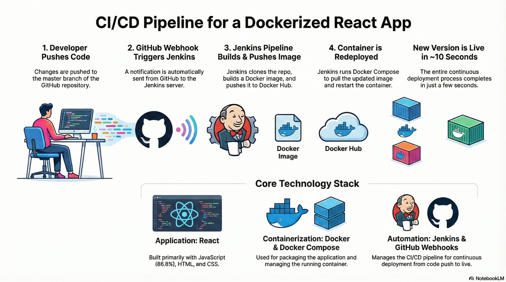
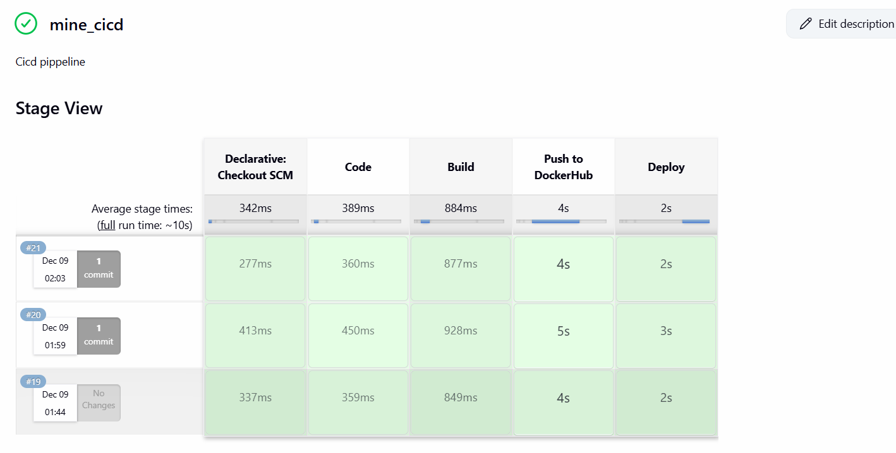

# Minegame – Dockerized React App with Jenkins CI/CD

Minegame is a React-based game application that is fully containerized and deployed using:

- **Docker** for packaging the app
- **Docker Compose** for running the container
- **Jenkins CI/CD pipeline** with **GitHub Webhook** for continuous deployment
- **Docker Hub** as the container registry

---

## 1. Architecture Overview

**End-to-end flow (Continuous Deployment):**

1. **Developer pushes code** to the `master` branch of this GitHub repo.
2. **GitHub Webhook** sends a notification to Jenkins.
3. **Jenkins pipeline** (`Jenkinsfile`) is triggered:
   - Clones the repo
   - Builds the Docker image
   - Tags & pushes the image to Docker Hub
   - Runs `docker-compose` to redeploy the container
4. **Updated container** is pulled and started via `docker-compose.yml`.
5. The new version of **Minegame** is live in just a few seconds (≈10s depending on machine/network).

---



## 2. Prerequisites

Before you deploy, ensure you have:

- A **Linux server** (or any host) with:
  - Docker installed
  - Docker Compose installed
- **Jenkins** installed on the same host (with permission to run Docker & Docker Compose)
- A **Docker Hub** account
- This repository cloned or accessible via Jenkins

---

## 3. Docker Setup

This project uses a `dockerfile` (note the lowercase name) to containerize the React app.

### 3.1. Build the Docker Image Manually (Optional)

From the project root:


# Build the image from the dockerfile
`docker build -t mine_img -f dockerfile .`

# Run the container
`docker run -d -p 3000:3000 --name minegame-container mine_img`

# React
```
npm install
npm start
```

# Docker
```
docker build -t minegame-app .
docker run -d -p 3000:3000 --name minegame-container minegame-app
docker stop minegame-container
docker rm minegame-container
```

# Docker Compose
```

docker-compose up -d
docker-compose down
```


